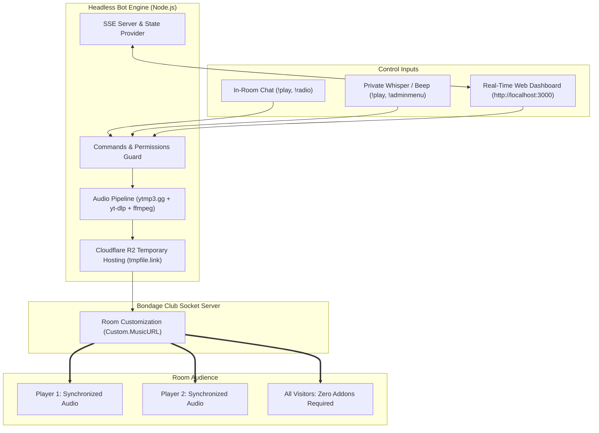

<div align="center">

# 🎧 NAVA MUSIC BOT & WEB DASHBOARD
### Standalone In-Room Audio DJ & Real-Time Control Center for Bondage Club (R132+)

[](https://nodejs.org/)
[](https://www.bondage-asia.com/club/R132/)
[-10b981?style=for-the-badge&logo=w3c&logoColor=white)](https://www.w3.org/WAI/WCAG2AA-Conformance)
[](#-real-time-web-dashboard)
[](#-how-it-works)

<p align="center">
  <a href="#-how-it-works">How It Works</a> •
  <a href="#-key-features">Key Features</a> •
  <a href="#-system-architecture">Architecture</a> •
  <a href="#-real-time-web-dashboard">Web Dashboard</a> •
  <a href="#-radio-stations">Radio Stations</a> •
  <a href="#-command-reference">Commands</a> •
  <a href="#-setup--installation">Setup</a>
</p>

</div>

---

> [!IMPORTANT]
> **Heard by Everyone in the Room Without Any Addons**  
> This bot utilizes the official Bondage Club room customization feature (`Custom.MusicURL`). Whenever a track or radio station is played or changed, the game server broadcasts the audio stream directly to **all players inside the room**, synchronizing playback across all speakers and headsets without requiring any player to install client scripts or browser extensions.

---

## ⚡ System Architecture



---

## 🌟 Key Features

| Category | Capability | Description |
| :--- | :--- | :--- |
| **Autonomous Bot** | **Headless Character** | Operates as an independent background account. Your main avatar plays freely without attaching scripts. |
| **Audio Broadcast** | **Zero-Addon Sync** | Uses native game room audio broadcast. Everyone inside the room hears music synchronously. |
| **Resilient Pipeline**| **Dual-Engine Transcoder** | Remote conversion via ytmp3.gg with automated local fallback using `yt-dlp` and `ffmpeg-static`. |
| **Cloud Storage** | **Instant Auto-Purge** | Audio is hosted on Cloudflare R2 (`tmpfile.link`). Local files in `converted_tracks/` are deleted right after upload. |
| **Web Console** | **Live SSE Dashboard** | Real-time push updates (0ms delay), spinning vinyl turntable, track progress bar, and browser audio stream. |
| **UI Design** | **Anti-Slop Standards** | WCAG AA contrast ratio (> 17:1), Source Sans Pro typography, and Cyber Club DJ Console background. |
| **Dual Theme** | **Dark & Light Mode** | Instant toggle on navbar with persistent `localStorage` preference. |
| **Discreet Control** | **Whisper Commands** | Queue tracks (`!play`) or manage private room settings (`!adminmenu`) directly via private whispers. |
| **Auto-Join** | **Beep Relocation** | Authorized members can summon the bot to any room by sending a beep with `join here`. |

---

## 🖥️ Real-Time Web Dashboard

The bot embeds an HTTP and Server-Sent Events (SSE) web server on `http://localhost:3000`.

### Interface Highlights:
- **Now Playing Display**: Holographic vinyl player disc with live rotation animation, track duration bar, and direct browser audio toggle ("Listen in Browser").
- **Player & Queue Manager**: Form to search tracks, quick action buttons (Skip, Stop, Clear), and live upcoming queue items (up to 20 tracks).
- **24/7 Radio Station Matrix**: One-click genre buttons with frequency badges (Lo-Fi, Synthwave, EDM, Rock, Jazz, and more).
- **Interactive Room Controls**: Send chat messages, emotes, and preset bot facial expressions directly from your browser.
- **Room Administration Tabbed Panel**: Real-time management of room administrators, whitelist, and banlist with single-click removal.
- **Authorized Members Panel**: Manage trusted users who possess master bot privileges and quick room switching capabilities.

---

## 📻 Radio Stations

Built-in 24/7 commercial radio stations configured with clean MP3 audio streams:

| Station ID | Station Name | Musical Genre | Quick Command |
| :--- | :--- | :--- | :--- |
| `lofi` | **Lo-Fi Chill Beats** | Relaxing Beats, Study & Chill ☕ | `!radio lofi` |
| `synth` | **Nightride FM** | Synthwave, Darksynth & Retrowave 🕹️ | `!radio synth` |
| `chillsynth` | **Chillsynth FM** | Ambient Chillwave & Downtempo 🌌 | `!radio chillsynth` |
| `pop` | **Top 40 Pop Hits** | Mainstream Global Pop Hits 🎧 | `!radio pop` |
| `dance` | **Club Dance & EDM** | Electronic Dance, House & Club 💃 | `!radio dance` |
| `rock` | **Rock Nonstop** | Classic Rock, Hard Rock & Alternative 🎸 | `!radio rock` |
| `hiphop` | **Hip Hop Beats** | Modern & 90s Hip Hop, Rap 🎤 | `!radio hiphop` |
| `jazz` | **Swiss Jazz & Lounge** | Classic Cafe Jazz & Acoustic Lounge 🎷 | `!radio jazz` |

---

## 💬 Command Reference

Commands can be typed in **Room Chat** or sent via **Private Whisper (Beep)** to the bot account (**`#258115`**).

### 🎵 Music & Playback Commands

| Command | Example | Description |
| :--- | :--- | :--- |
| `!help` or `!music` | `!help` | Displays available bot commands and radio station shortcuts. |
| `!play <title / URL>` | `!play Linkin Park Numb` | Plays or queues a YouTube song, search keyword, or direct MP3 audio stream. (Alias: `!yt`) |
| `!queue` or `!q` | `!queue` | Lists currently playing track and upcoming queued songs. |
| `!skip` or `!next` | `!skip` | Skips current track and starts next song in queue. |
| `!clear` | `!clear` | Empties all upcoming songs from queue. |
| `!radio <genre>` | `!radio synth` | Switches room music to a 24/7 radio stream. |
| `!stop` | `!stop` | Stops room music and clears queue. |
| `!np` | `!np` | Shows currently playing track name, requester, and duration. |

### 🛡️ Room Administration Commands

| Command | Example | Allowed Role | Description |
| :--- | :--- | :--- | :--- |
| `!adminmenu` | `!adminmenu` | Room Admin | **Whisper only**: Opens interactive room administration options. |
| `!whitelist <id>` | `!whitelist 254143` | Room Admin | Adds a player to the room whitelist. |
| `!kick <id>` | `!kick 12345` | Room Admin | Kicks a member out of the private room. |
| `!ban <id>` | `!ban 12345` | Room Admin | Adds a member to the room banlist. |

### 👑 Authorized Companion & Follower Commands

Natural speech commands spoken in normal room chat by **Authorized Members**:

| Spoken Chat Command | Bot Reply | Behavior Description |
| :--- | :--- | :--- |
| `Nava, follow me` | `"Yes Mistress"` | Activates Follow Mode. Stops current music and pauses public bot features (`!help`, playback). Automatically detects and follows the mistress across rooms. |
| `Nava, stay here` | `"Yes Mistress"` | Deactivates Follow Mode. Bot stays in the current room and restores full DJ operations (`!help`, music playback). |

---

## 🛠️ Setup & Installation

### Prerequisites
- **[Node.js](https://nodejs.org/)**: Version 18.0.0 or higher.
- **[Python 3](https://www.python.org/)**: Required for local `yt-dlp` YouTube extraction fallback.

### Step 1: Clone & Install Dependencies
```bash
git clone https://github.com/andifadli267/web-music-bot.git
cd web-music-bot/headless-bot
npm install
```

### Step 2: Configure Environment (`.env`)
Create or edit `headless-bot/.env` with your bot's character credentials:
```env
BC_SERVER_URL=https://www.bondage-asia.com
BC_BOT_USERNAME=Nava1
BC_BOT_PASSWORD=your_secret_password
BC_TARGET_ROOM=V Main Hall
BC_ROOM_PASSWORD=
PORT=3000
```

### Step 3: Launch the Bot
Start via terminal or batch script:
```bash
# Windows Batch:
start-bot.bat

# Or directly with Node.js:
node bot.js
```

### Step 4: Join the Room
1. Open **Bondage Club** ([bondage-asia.com](https://www.bondage-asia.com/club/R132/)) or **BC-Desktop**.
2. Enter your private room (e.g. **`V Main Hall`**).
3. Ensure the bot's Member Number (e.g. `#258115`) is added to the room's **Whitelist** or **Admin** list so it can enter freely.
4. Open **`http://localhost:3000`** in your browser to view the live dashboard!

---

<div align="center">

Made for **Bondage Club** Room Audio Automation • Designed with **Anti-Slop Craftsmanship**

</div>
